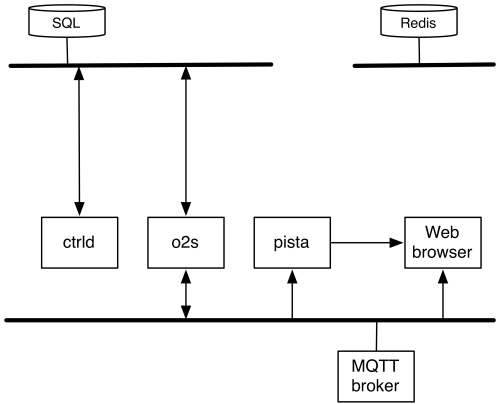

## Pista


The OwnTracks back-end is a set of components intended to work with the [owntracks.org](http://owntracks.org) apps for Android and iOS as well as the Greenwich, OwnTracks edition.

This back-end superceeds what has so-far been known as `m2s`, but has, in all honesty, a focus on the OwnTracks Greenwich devices, so there are features here which will not be useful for app users. If you are an app user and wish to experiment with the OwnTracks back-end, read [Migration](#migration) before continuing.

The backend consists of a number of utilities:

* [o2s](#o2s)
* [pista](#pista)
* [ctrld](#ctrld)




These components work hand-in-hand and consist of a number of _features_ which can be
enabled/disabled through a configuration file. Although we have attempted to test different
combinations of features, be warned that not all combinations are extensively tested. Our
environment uses all features, and this documentation discusses these.

Keep a copy of the extensively documented configuration file `o2s.conf.sample` handy for reference.

We typically use a double-broker approach: our main broker is the endpoint for devices, and
we run a secondary broker which bridges _in_ the `owntracks/#` topics. It is to *this* broker
that we connect `o2s` and `pista`, and the latter requires a broker with Websocket support (e.g.
Mosquitto 1.4 or higher).

### Database

Upon launching one of the utilities, the database schema is created:

* `acl` defines access control for [mosquitto-auth-plug].
* `geo` stores reverse geo data, indexed by _ghash_.
* `inventory` contains a list of Greenwich devices, indexed by IMEI.
* `location` stores location publishes
* `obd2` holds OBD2 (CAN-BUS) data
* `operators` used if the `plmn` feature is enabled to store mobile operator codes
* `params` for _ctrld_
* `rawdata` raw incoming data
* `user` authenticates users in [mosquitto-auth-plug] and in _pista_.
* `waypoint` waypoints table. This is also the basis for drawing geo fences on the map.
* `lastloc` contains the last location of each device; basically `location` but only the last.

### `o2s`

_o2s_ (OwnTracks to Storage) is responsible for subscribing to MQTT for the OwnTracks topics and comitting these to storage (i.e. to a database). In particular, _o2s_ also provides support for

* Republishing formatted debugging strings to the `_look` topic so that Pista (Tables, Map, Console) see what's going on
* Republishing whole "objects" to the `_map/` topic
* Handling geo-fences from waypoints (enter/leave)
* Storing OBD2 data
* Optional storage of raw data (i.e. all subscribes seen go to database table for debugging purposes)

Upon startup, _o2s_ connects to the configured MQTT broker, subscribes to a
list of topics and awaits publishes from OwnTracks devices. Location and
Waypoint publishes are comitted to storage.


#### `_map/`

Location and other publishes from devices (e.g. `startup/`, `gpio/`,
`voltage/`) are gathered together to form an "object" which, when complete, is
published to `_map/` when it changes. This object is used by _pista_ to display
information in its individual pages. An object published
thusly might look like this:

```json
{
  "vel": 0,
  "tstamp": "2014-11-01T09:48:53Z",
  "tst": 1414835333,
  "topic": "owntracks/gw/BB",
  "tid": "BB",
  "t" : "t",
  "status": -1,
  "lon": -5.184415,
  "_type": "location",
  "addr": "A-397, 29400 Ronda, Málaga, Spain",
  "alt": 569,
  "cc": "ES",
  "cog": 0,
  "compass": "N",
  "dstamp": "01/10:48:53",
  "lat": 36.766928,
  "dist": 1,
  "trip":30700
}
```

Note for example the `tstamp`, `status`, `addr`, and `compass` elements which are not part
of the [OwnTracks JSON](https://github.com/owntracks/owntracks/wiki/JSON) format for Location
publishes. These elements are assembled by _o2s_ into this object, allowing us to use a single
(large) JSON publish to pass all device information at once to the Pista websocket clients.

#### Waypoints

_map/9e33dafec92ce71a34f3cf10b8d747b7834bda7e {"lat": 51.1694, "radius": 300, "_type": "fence", "lon": 4.38942, "waypoint": "LOADays"}

#### `_alerts/`

```json
{
  "wptopic": "owntracks/gw/BB",
  "wpname": "our favorite restaurant",
  "wplon": xxx.xxx,
  "wplat": yyy.yyy,
  "vel": 0,
  "tstamp": "2014-10-30T18:06:49Z",
  "event": "leaves",
  "dstamp": "30/19:06:49",
  "compass": "N",
  "cog": 0,
  "cc": "DE",
  "alt": 186,
  "addr": "Demo Way 27",
  "_type": "alert",
  "km": "56.08",
  "lat": xxx.xxx,
  "lon": yyy.yyy,
  "meters": 128,
  "status": 1,
  "tid": "BB",
  "trigger": 0,
  "tst": 1414692409
}
```

### `pista`

_pista_ (the Spanish and Italian word for _track_) is a Python Bottle app which works hand-in-hand with _o2s_ for displaying data, maps, tracks and information from that database. Pista itself
is a collection of individual pages called Table, Tracks, Map, Hardware, etc. which you enable
or disable for your installation. For example, if you're interested in data from a couple of
[owtracks.org] apps only, you will not need the Hardware page (which shows information which our
apps don't publish anyway; this is interesting for the Greenwich devices only).

Pista requires connection to an MQTT broker with support for Websockets (e.g. Mosquitto version 1.4 or higher, HiveMQ, or similar). Pista can make use of TLS connections for Websockets, but will
probably not work if it is used behind a (corporate) HTTP proxy.

Ensure you've configured `o2s.conf` and that the environment variable
`O2SCONFIG` points to that file so that _pista_ will be able to access _o2s_' database.

Run `./pista.py` and connect to it with a supported Web browser. By default, the address is `http://127.0.0.1:8080`.

### Authentication / Authorization

We use pista in combination with [mosquitto-auth-plug] which allows us to use the
same authentication database tables for both. In this model, a user logs on to
_pista_ with HTTP Basic authentication and we re-use these credentials to connect
to the MQTT broker, thus ensuring that a user can only see what she or he is allowed
to see. We thus configure the `[websocket]` section like this:

```ini
basic_auth = True
username = None
password = None
```

If your MQTT broker uses a different combination of usernames and passwords, then
you'll have to configure the `[websocket]` section as

```ini
basic_auth = False
username = "xxx"
password = "secret"
```

but that may allow a user to "see" more than she's supposed to see.


### Credits

* Brand image from [openclipart](https://openclipart.org/detail/28088/Roadsign_slippery-by-Simarilius)

### `ctrld`

_ctrld_ (CTRL Daemon) is a RESTful API for
[CTRL](https://github.com/owntracks/OwnTracksCTRL), a specialized utility which
is probably not something you readily require, but it is, nevertheless, part of
the back-end.

It basically provides authentication services and track dumps for this app, and is able to
supply an X.509 CA certificate for MQTT connections.

### Prerequisites

In order to run the OwnTracks back-end you will need:

* An MQTT broker with Websockets capabilities. This could be, say, Mosquitto (version 1.4 or higher) or HiveMQ.
* A database supported by `o2s`; this is currently one of SQLite, PostgreSQL or MySQL, whereby we test only with the latter.
* A Linux host
* Python 2.7.x
* An optional HTTP server (Apache or nginx)
* Quite a bit of patience


### Installation

##### Install Mosquitto 1.4

##### Configure Mosquitto

The broker we'll be connecting to from _o2s_ and _pista_ is a local Mosquitto 1.4
which is configured to _bridge in_ all `owntracks/#` topics.

```
autosave_interval 1800
persistence true
persistence_file mosquitto.db
persistence_location /tmp/
connection_messages true
log_timestamp true
log_dest stderr
log_type debug

listener 1883

listener 9001
protocol websockets

connection deb-local140
address 172.16.153.1:1889
username debridge
cleansession true
clientid br-deb-local140
start_type automatic
topic # in 0 owntracks/ owntracks/
notifications true
try_private true
```

##### Create a database

```
$ mysqladmin -u root -p create owntracks
$ mysql -u root -p owntracks
mysql> GRANT ALL ON owntracks.* TO 'jane'@'localhost' IDENTIFIED BY 'secret';
```

#### Create and activate a virtualenv

```
$ virtualenv --no-site-packages pista
$ cd pista
$ source bin/activate
```

##### Clone the _pista_ repository


```
$ git clone https://github.com/owntracks/pista.git
$ pip install -r requirements.txt
```

Edit and adjust the configuration file, for example:

```ini
[defaults]
loglevel   = DEBUG
logformat  = '%(asctime)-15s %(levelname)-5s [%(module)s] %(message)s'

[features]
storage = True
plmn = False
watcher = "_owntracks/_look/{0}"
geofences = 'db.geofences.pickle'
rawdata = False
alarm = "alarmhelper.py"
t_ignore = [ 'p', ]
o2smonitor = "_owntracks/o2s"

[mqtt]
host = localhost
port = 1883
username = None
password = None
client_id = 'yyyx01'
ca_certs = None
skip_retained = False
base_topics = [ 'owntracks/gw', 'owntracks/jane']
maptopic = "_owntracks/_map/{0}"
alert_topic = "_alerts"
alert_keys = None

[database]
dbengine = mysql
dbhost = 'localhost'
dbname = 'owntracks'
dbuser = 'jane'
dbpasswd = 'secret'

[revgeo]
enabled = True
ghashlen = 5  ; default=5
region_bias = "de"

[pista]
listen_host = "172.16.153.112"
listen_port = 8080
pages = ['map', 'table', 'tracks', 'console', 'status', 'hw' ]

[websocket]
host = "172.16.153.112"
port = 9001
reconnect_in = 5000 ; milliseconds
usetls = False
cleansession = True
basic_auth = True
username = None
password = None
apiKey = None
console_topic = "_owntracks/_look/#"
maptopic = "_owntracks/_map/+/+/+"
topic_visible = False
```


##### Launch _o2s_

check tables


##### Create user for _pista_

mysql> INSERT INTO user (username, pwhash, superuser) VALUES ('ttt', 'secret', 1);


#### Visit _pista_

http:/..../index


#### uWSGI

There are about a trillion and a half ways of installing a uWSGI application behind an
Apache or NGINX Web server. These are just a few notes on using _pista_ behind an Apache
reverse proxy.

##### Apache location

Configure a location and proxy that to the loopback address, port 3031 (or any other free
TCP port number) on your Apache server.

```
<Location /pista>
   RedirectMatch /pista$ /pista/
   ProxyPassReverse http://127.0.0.1:3031
</Location>
```

Download and install uWSGI as [per instructions](http://uwsgi-docs.readthedocs.org/en/latest/Download.html). In the simplest of cases download the tarball of a stable version, extract and run `make`; this should create the `uwsgi` binary.

Create a configuration file for _pista_ under uWSGI, called `pista.ini`:


```ini
[uwsgi]
base = /Users/jpm/Auto/projects/on-github/owntracks/pista
chdir = %(base)

socket = 127.0.0.1:3031
protocol = http
processes = 1

file  = pista.py
env = O2SCONFIG=/Users/jpm/Auto/projects/on-github/owntracks/pista/o2s.conf

# uid = www-data
# gid = www-data
logto = /tmp/uwsgi-%n.log

plugins = python
py-autoreload = 1
```

Launch that by running `uwsgi pista.ini`. This will launch the application and have it listen
to HTTP requests on the configured address/port number.

Use your Web browser to access your Apache server at the `/pista` location you defined above. (`http://my-apache.example.org/pista/index`.

### Testing

* From within the browser, obtain `http://.../config.js` and verify its content. This
  file is created from a template intermixed with values from `o2s.conf`. In particular
  the MQTT parameters must be those of the Websocket-enabled MQTT broker, and please
  note: *the Websocket connection is as seen from your Web browser!*.

* Publish a test location message to your broker, and verify that the `location` and `geo`
  database tables are being populated. Simultaneously, you should see an entry on _Table_,
  on _Map_, and on _Status_. (See `tools/test-pub.sh`.)

```bash
mosquitto_pub -t owntracks/gw/jjolie -m '{"cog":-1,"batt":"79","lon":"2.295134","acc":"10","vel":0,"vac":3,"lat":"48.858334","t":"t","tst":"1415719099","alt":171,"_type":"location","tid":"jj"}'
```

### Migration from `m2s`

### Reverse-Geo lookups

Every time we receive a location update, we check whether this update is within
reasonable distance from one we already know of, and if so, we use a previously
cached reverse-geo information so as to not impose on online services. This caching
is performed by storing the [geohash](http://en.wikipedia.org/wiki/Geohash) of
the lat,lon pair using
[python-geohash](https://code.google.com/p/python-geohash/), and truncating the
result to six characters.

Consider the following example which illustrates how a six character hash is
equivalent to reducing precision on lat, lon:

```python
import geohash
import sys

lat = 47.488613
lon = 13.187296

print "Original lat,lon: ", lat, lon
full = geohash.encode(float(lat), float(lon))
print "Full geohash: ", full

hashlen = 6

print geohash.encode(47.488613,  13.187296)[:hashlen]
print geohash.encode(47.48861,  13.18729)[:hashlen]
print geohash.encode(47.4886,  13.1872)[:hashlen]
print geohash.encode(47.488,  13.187)[:hashlen]
```

The program outputs:

```
Original lat,lon:  47.488613 13.187296
Full geohash:  u23qhj49nr0d
u23qhj
u23qhj
u23qhj
u23qhh
```

See [geohash.org](http://geohash.org).


  [mosquitto-auth-plug]: https://github.com/jpmens/mosquitto-auth-plug
