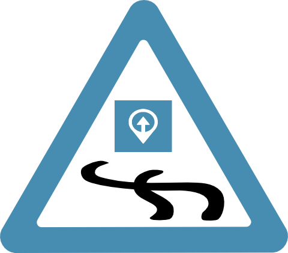

# pista

_pista_ (the Spanish word for _track_) is a Python Bottle app which works hand-in-hand with _o2s_ for displaying data, maps, tracks and information from that database.

Ensure you've configured `o2s.conf` and that the environment variable
`O2SCONFIG` points to that file so that _pista_ will be able to access _o2s_' database.

Copy `pista.conf.sample` to `pista.conf`, adjust the settings therein as described in the comments, and configure the environment variable `PISTACONFIG` to point to that file.

Run `./pista.py` and connect to it with a supported Web browser. By default, the address is `http://127.0.0.1:8080`.

### Credits

* Brand image from [openclipart](https://openclipart.org/detail/28088/Roadsign_slippery-by-Simarilius)
